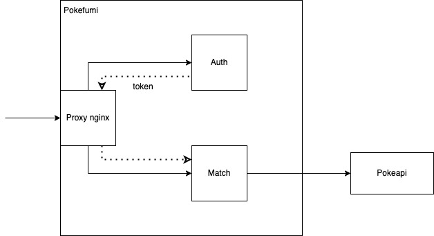

# Pokefumi

## Architecture

Ce projet est composé de 3 services :

Choix techniques
----------------

Nous avons découpé notre application en différents services pour séparer
les responsabilités et éviter les situations complexes.

### Micro Service d’authentification

Ce service gère tous les aspects de l’authentification d’un utilisateur:
la création de nouveau compte, l’authentification à un compte existant,
la remise de token pour les comptes authentifiés.

### Micro Service de Match Pokémon

Ce service gère la gestion d’utilisateur, les tours de jeux et les
adversaires dans un match.

### Micro Service de Proxy NGINX

Ce service gère la répartition des requêtes entre les différents micro
services

Endpoints
---------

### Authentification

  Method  | URL                               | Description
  --------|-----------------------------------|----------------------------------------
  GET     |<http://0.0.0.0:80/api/auth/>        |Récupérer tous les utilisateurs
  POST    |<http://0.0.0.0:80/api/auth/login>   |Se connecter avec username et password
  POST    |<http://0.0.0.0:80/api/auth/signup>  |S’inscrire avec username et password

### Matchs

Routes

  Method  |URL                                      |Description
  --------|-----------------------------------------|---------------------------------
  GET     |<http://0.0.0.0:80/api/round/>             |Récupérer tous les tours
  GET     |<http://0.0.0.0:80/api/round/:id>          |Récupérer un tour avec un id
  POST    |<http://0.0.0.0:80/api/round/>             |créer un nouveau tour
  POST    |<http://0.0.0.0:80/api/round/:id/pokemon>  |Ajouter son pokémon au round id

Matches

  Method  |URL                                      |Description
  --------|-----------------------------------------|-----------------------------------------------------------
  GET     |<http://0.0.0.0:80/api/match>              | Récupérer tous les matches
  GET     |<http://0.0.0.0:80/api/match/:id>          | Récupérer un match avec un id
  POST    |<http://0.0.0.0:80/api/match/>             | créer un nouveau match avec 1 ou 2 utilisateurs
  POST    |<http://0.0.0.0:80/api/match/:id/invite>   | Permet à un utilisateur de rejoindre un match avec son id
  POST    |<http://0.0.0.0:80/api/match/:id/pokemon>  | Ajouter un pokémon au match avec son id

Utilisateurs

  Method  |URL                          |Description
  --------|-----------------------------|---------------------------------
  GET     |<http://0.0.0.0:80/api/user/>  |Récupérer tous les utilisateurs

Vous pouvez tester notre application grâce à notre collection postman :
[*https://www.getpostman.com/collections/c100c57af4f279aecdaf*](https://www.getpostman.com/collections/c100c57af4f279aecdaf)
